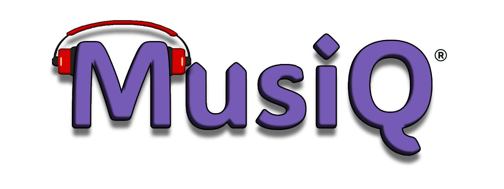

# MusiQ



MusiQ es una aplicación web diseñada para simplificar el proceso de solicitar canciones en entornos como gimnasios, cafeterías o cualquier negocio que reproduzca música. En lugar de acercarse al gerente para solicitar una canción, los usuarios pueden simplemente escanear un código QR y hacer sus peticiones a través de la aplicación.

## Características principales

- **Integración de código QR**: Los usuarios pueden escanear un código QR para acceder a la interfaz de solicitud de canciones.
- **Solicitud de canciones**: Los usuarios pueden buscar y solicitar canciones directamente a través de la aplicación.
- **Gestión de cola**: Los gerentes pueden ver y administrar la cola de canciones fácilmente.
- **Interfaz amigable**: Diseño simple e intuitivo tanto para usuarios como para gerentes.

## Tecnologías utilizadas

- **Next.js**: Un framework de React para construir aplicaciones web renderizadas del lado del servidor y generadas estáticamente.
- **Tailwind CSS**: Un framework de CSS utilitario para construir rápidamente interfaces de usuario personalizadas.
- **Node.js**: Un entorno de ejecución de JavaScript construido sobre el motor V8 de Chrome.
- **React**: Una biblioteca de JavaScript para construir interfaces de usuario.

## Dependencias principales

- **next**: El framework de React para producción.
- **react**: Una biblioteca de JavaScript para construir interfaces de usuario.
- **react-dom**: Sirve como punto de entrada a los renderizadores DOM y servidor para React.
- **tailwindcss**: Un framework de CSS utilitario.
- **axios**: Cliente HTTP basado en promesas para el navegador y node.js.

## Instalación

1. Clona este repositorio en tu máquina local.

   ```
   git clone https://github.com/tu-usuario/musiq.git
   ```

2. Instala las dependencias.

   ```
   cd musiq
   npm install
   ```

3. Inicia el servidor de desarrollo.

   ```
   npm run dev
   ```

4. Abre tu navegador web y accede a `http://localhost:3000` para ver la aplicación en funcionamiento.

## Equipo

| Nombre               | Rol            |
| -------------------- | -------------- |
| Valentín Ballesteros | Dev FullStack  |
| Micaela Hormazabal   | Dev Frontend   |
| Cristian Ortega      | Dev Frontend   |
| Milagros             | Diseñadora     |

## Licencia

Este proyecto está licenciado bajo la Licencia MIT. Consulta el archivo [LICENSE](LICENSE) para obtener más detalles.

## Contacto

Si tienes alguna pregunta o sugerencia sobre este proyecto, no dudes en ponerte en contacto con nosotros en [correo electrónico](mailto:tu-email@ejemplo.com).
